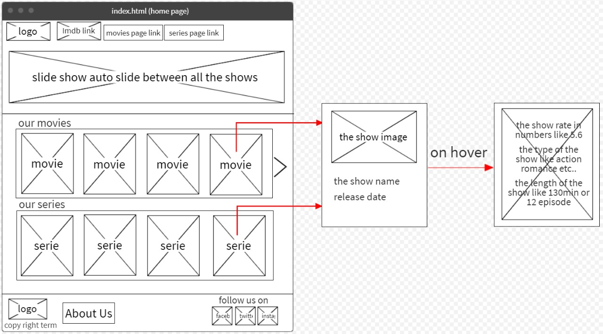
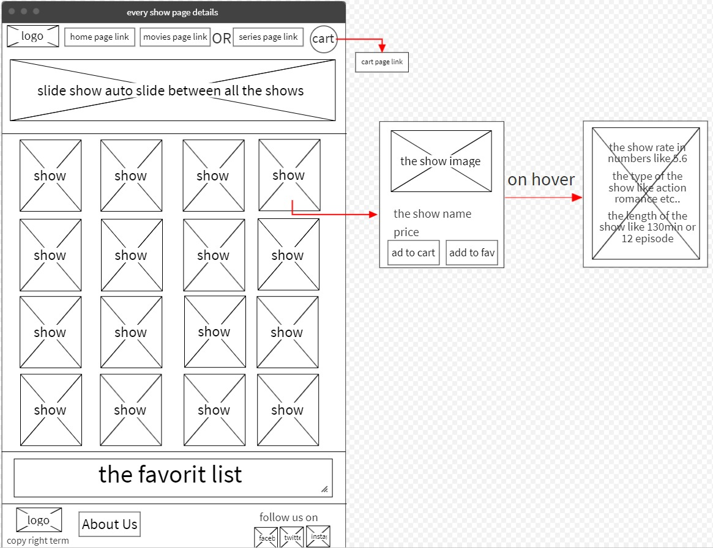
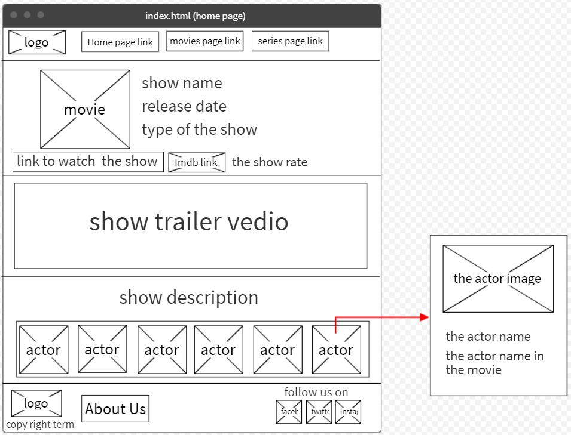
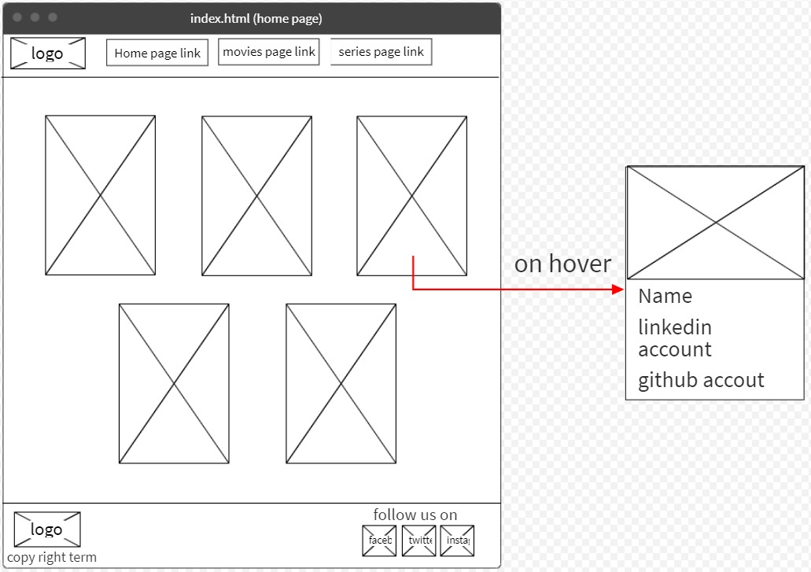
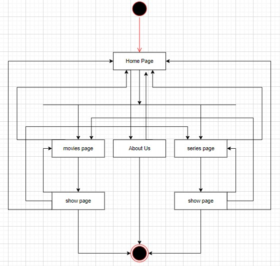

## Task 1-1
Our real problem that we choose it to do is create a website that show movies animes and series this website can help the user to watch any thing he want starting from short movies to series and animes in a same website that’s will help the user to reduce time of search and enjoy this time watching what he loves, and the main problem that all users faced it when they go to show movies in a movies website is the ads so our website is characterized by there is no ads in it this that will makes the user feel good when he want to search and show the movie he want or also to browse  new movies in our website which it does not cause the user to be bored or disgusted, also our website is interactive, simple and have a good colors to does not cause eye pain or headache when you stay a lot in it. So it's easy to use and no need to practice or to watch vides explains how to use also our website have a favorite list that help the user to save what he want by adding the movies or series etc. to list to remember something that he want to show soon.
So our website solve the problem of watching anything in same website, our website doesn’t have the main reason of bored which is the ads, it's easy to use and it’s have a favorite list to help users.

## Task 1-2

1. Inaccurate Estimations
If the expectations do not match reality, it can lead to a delay in the time of completion of the project according to the time that was expected so we will be late so we have to try hard to predict the time required for each process correctly to avoid such risks.
2. Technical problems
Because our work relies at all in technical things so our main risk this will be if we lost the Internet network or someone’s laptop breakdown or the server that we work on it face a malfunctioning etc. all these things will reach us to the time risk which is one of big risks, so technical problems it’s our biggest fear.
3. Poor Quality Code
We want to write an organized code to be good and easy to understanding for other members in the team so in this way we will reduce to be poor the quality of code cause all small problem will appear when it’s organized and then we can solve it early before problems gather in our code and then be have a poor quality.
4. Problems between team members 
Tension and work pressure may lead to sharp discussions between team members, which may end in serious problems and negatively affect the team’s performance. Also, one of the team members does not do the tasks directed to him and complete them in the required time. All of these things may lead to problems between team members, the risk of which increases if the team begins to disintegrate then it will be a potential risk to the project.

5. Weakness in project management
Weak project management, don't write of initial plans, the problems that may face us, write the prior secondary solutions, forecasting of events, and poor planning in all stages of construction of the code may lead to a great risk, which is the failure to complete the project and achieve its requirements, so we must write a complete planning from the first step at the beginning of building the project.

## Task 1-3

## List of requirements

1. Nav bar include imdb logo, website logo and buttons linked to other pages to move between 
2. Movie details (Name, Story, Type, Rate, actors, trailer, movie image)
3. Add ads for the latest movies like adding trailer in the home page or slideshow pictures
4. Colors and background (design)
5. Search icon to search movies or series
6. Favorite list to user add his favorite movie or series
7. Logo for the website
8. Social media icons linked with website pages 
9. Shopping cart when user select a movie

## Database design and the wireframe

Database design : LocalStorage 

LocalStorage : Is a feature that allows JavaScript sites and apps to save key-value pairs in a web browser without having to worry about them expiring. This means that the data stored in the browser will survive the closing of the browser window.

We will use LocalStorage to save the add items in favorite list it in the browser when the user back to the website after he close the website.

## Wireframe

* Main Website Page

Here will have at the first of page the bar that have our logo and IMDb link also two options to move to series page or movies page and also the search icon then we have a slide show to the best movies for this month then we have a small list of top movies contain of 5 movies then also a small list of top series contain of 5 series and at the end of page we have our logo, copyright, about us option to move to about us page and icons move you to our pages in social media.

* Movies and Series pages

First in the page we have the logo then if you are In movies page you will see to options home to back to the main page and series to move to the series page and if you are in series page you will see the home option and the movies option that move you to the movies page, then the cart button to move to add to cart page after the bar we will add a trailer video of best movie or for any movie need ad, then you will show a list of movies and after the list in the end of page our logo and the social media icons.

* All information about the series or movie in details

At the first of page our logo then Movie, home and series options then the movie image behind it the movie name, year, type, imdb link, rate etc. then the movie trailer then story and finally the actors. 

* About Us page

At the first of page our logo then Movie, home and series options then every member in this team image with his name and details and at the end of page the logo and the social media icons.

## Activity Diagram

* From the Home page you can move to movies, about us and series page.
* In movies page you can move to home, sereies, movie show page (Details) and about us page. 
* Series page you can move from it to home, movie page, series show page (Details) and about us page. 
* Show page for series and movies you can move from to home, series page, movies page and about us page.
* From about us page tou can move to home page, series page and movies page.

## Coding and implementation technique

Coding and implementation technique : Agile software development

What is Agile Software Development, and how does it differ from traditional software development?
Scrum, Extreme Programming, and Feature-Driven Development are examples of agile software development frameworks (FDD).

Pair programming, test-driven development, stand-ups, planning meetings, and sprints are all examples of agile software development approaches.
The Manifesto for Agile Software Development and its 12 Ideas are an umbrella title for a set of concepts and activities based on the ideals and principles articulated in the Manifesto for Agile Software Development. When approaching software development in a certain way, it's generally a good idea to live by these values and principles and use them to help you figure out what to do in your specific situation.

Agile differs from traditional software development methodologies in that it focuses on the people doing the job and how they collaborate. Collaboration between self-organizing cross-functional teams using the best methods for their context leads to solutions.

Methodologies for Agile
The four main values of Agile are:

1. People and their interactions vs. processes and tools
2. Useful software above thorough documentation
3. Collaboration with customers rather than contract negotiations
4. Adapting to change in a planned manner

## Testing technique

### Black Box Testing

Black Box Testing is a software testing method that involves testing the functions of software applications without knowing the internal code structure, implementation details, or internal routes. Black Box Testing is a type of software testing that focuses on the input and output of software applications and is totally driven by software requirements and specifications. Behavioral testing is another name for it.

There are many different types of Black Box Testing, but these are the most common:

Functional testing - This form of black box testing is concerned with a system's functional requirements and is carried out by software testers.

Non-functional testing - This type of black box testing is concerned with non-functional requirements such as performance, scalability, and usability rather than specific functionality.

Regression testing - Is performed after code changes, upgrades, or other system maintenance to ensure that the new code does not harm the existing code.

### White Box Testing

Is a software testing technique that involves examining the product's underlying structure, architecture, and coding in order to verify input-output flow and improve design, usability, and security. White box testing is also known as Clear box testing, Open box testing, Transparent box testing, Code-based testing, and Glass box testing since the code is visible to the testers.

Techniques for White Box Testing

Statement Coverage: During the software engineering testing process, this technique mandates that every possible statement in the code be tested at least once.

Branch Coverage - This technique examines every conceivable path of a software application (if-else and other conditional loops).

# Refrences

* CodeBots
https://codebots.com/way-of-working/what-are-the-10-biggest-risks-in-software-development

* LogRocket
https://blog.logrocket.com/localstorage-javascript-complete-guide/

* Agile Aliance
https://www.agilealliance.org/agile101/

* GURU99
https://www.guru99.com/black-box-testing.html

* GURU99
https://www.guru99.com/white-box-testing.html