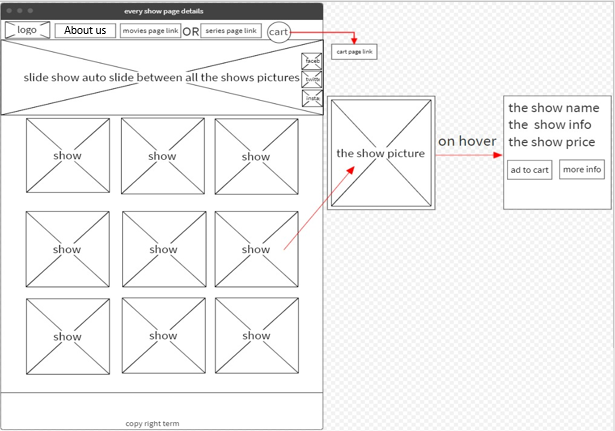

## Task 1-1
Our real problem that we choose it to do is create a website that selling movies and series this website can help the user to buy any thing he want starting from movies to series in a same website that’s will help the user to reduce time of shopping and enjoy this time watching what he buy, and the main problem that all users faced it when they go to movies website the ads, so our website is characterized by there is no ads in it this that will makes the user feel good when he want to search and buy the movie he want or also to browse new movies in our website which it does not cause the user to be bored or disgusted, also our website is interactive, simple and have a good colors to does not cause eye pain or headache when you stay a lot in it. So it's easy to use and no need to practice or to watch videos explains how to use also our website have a cart list that help the user to save what he want to buy by adding the movies or series to list. so our website solve the problem of buy anything in same website, our website doesn’t have the main reason of bored which is the ads, it's easy to use and it’s have a cart list to help users to choose and complete shopping or to make sure what items he choose.

## Task 1-2

1. Inaccurate Estimations
If the expectations do not match reality, it can lead to a delay in the time of completion of the project according to the time that was expected so we will be late so we have to try hard to predict the time required for each process correctly to avoid such risks.
2. Technical problems
Because our work relies at all in technical things so our main risk this will be if we lost the Internet network or someone’s laptop breakdown or the server that we work on it face a malfunctioning etc. all these things will reach us to the time risk which is one of big risks, so technical problems it’s our biggest fear.
3. Poor Quality Code
We want to write an organized code to be good and easy to understanding for other members in the team so in this way we will reduce to be poor the quality of code cause all small problem will appear when it’s organized and then we can solve it early before problems gather in our code and then be have a poor quality.
4. Problems between team members 
Tension and work pressure may lead to sharp discussions between team members, which may end in serious problems and negatively affect the team’s performance. Also, one of the team members does not do the tasks directed to him and complete them in the required time. All of these things may lead to problems between team members, the risk of which increases if the team begins to disintegrate then it will be a potential risk to the project.

5. Weakness in project management
Weak project management, don't write of initial plans, the problems that may face us, write the prior secondary solutions, forecasting of events, and poor planning in all stages of construction of the code may lead to a great risk, which is the failure to complete the project and achieve its requirements, so we must write a complete planning from the first step at the beginning of building the project.

## Task 1-3

## List of requirements

1. Nav bar include website logo and buttons linked to other pages to move between. 
2. Movie details (Name, type, Story, trailer, movie image).
3. Add ads for the latest movies like adding trailer in the home page or slideshow pictures.
4. Colors and background (design).
5. Social media icons linked with website pages.
6. Shopping cart to add a movie or series when user select a movie.

## Database design and the wireframe

Database design : LocalStorage 

LocalStorage: This is a feature that allows JavaScript sites and apps to save key-value pairs in a web browser without their expiring. This means that the data stored in the browser will survive the closing of the browser window.

We will use LocalStorage to save the add items in favorite list it in the browser when the user back to the website after he close the website.

## Wireframe

* Main Website Page

Here will have at the first of page the bar that have our logo also three options to move to series page or movies page and also the cart icon then we have a slide show that show trailer to the best movies for this month then we have a small icons of social media linked with website pages, then the name and the story, tybe of the movie and read more button move the user to show details page.

* Movies and Series pages

First in the page we have the logo then if you are In movies page you will see to options home to back to the main page and series to move to the series page and if you are in series page you will see the cart button to move to add to cart page after the bar user will show slide show of movies posters, then user will show a list of movies/series and after the list in the end of page copy right, in the right of page user will see the social media icons.

* All information about the series or movie in details

At the first of page our logo then Movie, series and about us options then the movie image at the background then movie name, story and watch trailer that move the user to the trailer of the movie, and small picture of movie poster, in the right of page user will see the social media icons.

* About Us page

At the first of page our logo then Movie and series options then every member in this team image with his name and details and at the end of page the copy right.

* Cart page

At this page the user will show every movie or series he choose it to buy and will have a delete option to delete movie or series from the list then below user will see a form to buy the items (Name, email, number) then confirm button to end the process.

## Activity Diagram

* From the Home page you can move to movies, about us and series page.
* In movies page you can move to home, sereies, movie show page (Details) and about us page. 
* Series page you can move from it to home, movie page, series show page (Details) and about us page. 
* Show page for series and movies you can move from to home, series page, movies page and about us page.
* From about us page tou can move to home page, series page and movies page.

## Coding and implementation technique

Coding and implementation technique : Agile software developmentWhat
What is Agile Software Development, and the way does it differ from traditional software development?Scrum, Extreme Programming, and Feature-Driven Development are samples of agile software development frameworks (FDD).

Agile software development methods include pair programming, test-driven development, stand-ups, planning sessions and sprints.
The Manifesto for Agile Software Development and its 12 Ideas are an umbrella title for a group of concepts and activities supported the ideals and principles articulated within the Manifesto for Agile Software Development.

It's generally an honest idea to measure by these values and principles while approaching software development during a given way, and to utilize them to assist you work out what to try to to in your individual scenario.Agile varies from traditional software development approaches therein it places a greater emphasis on the people doing the work and the way they work together. Solutions are found through collaboration between self-organizing cross-functional teams utilizing the acceptable methodologies for his or her environment.

Methodologies for Agile

The four main values of Agile are:

1. People and their interactions vs. processes and tools

2. Useful software above thorough documentation

3. Collaboration with customers instead of contract negotiations

4. Adapting to vary during a planned manner

## Testing technique

### Black Box Testing

Testing may be a software testing method that involves testing the functions of software applications without knowing the interior code structure, implementation details, or internal routes. recorder Testing may be a kind of software testing that's entirely driven by software requirements and specifications and focuses on the input and output of software applications, behavioral testing is another name for it.

There are many various sorts of recorder Testing, but these are the foremost common:

Functional testing - this type of recorder testing cares with a system's functional requirements and is administered by software testers.

Non-functional testing - Non-functional requirements like performance, scalability, and usefulness are the main target of this sort of recorder testing instead of specific functionality.

Regression testing - Is performed after code changes, upgrades, or other system maintenance to make sure that the new code doesn't harm the prevailing code.

### White Box Testing

Is a software testing technique that involves examining the product's underlying structure, architecture, and coding so as to verify input-output flow and improve design, usability, and security. White box testing is additionally referred to as Clear box testing, Open box testing, Transparent box testing, Code-based testing, and Glass box testing since the code is visible to the testers.
Techniques for White Box Testing.

Statement Coverage - During the software engineering testing process, this system mandates that each possible statement within the code be tested a minimum of once.

Branch Coverage - this system looks at every possible path a software application could take (if-else and other conditional loops).

# Refrences

* CodeBots
https://codebots.com/way-of-working/what-are-the-10-biggest-risks-in-software-development

* LogRocket
https://blog.logrocket.com/localstorage-javascript-complete-guide/

* Agile Aliance
https://www.agilealliance.org/agile101/

* GURU99
https://www.guru99.com/black-box-testing.html

* GURU99
https://www.guru99.com/white-box-testing.html

